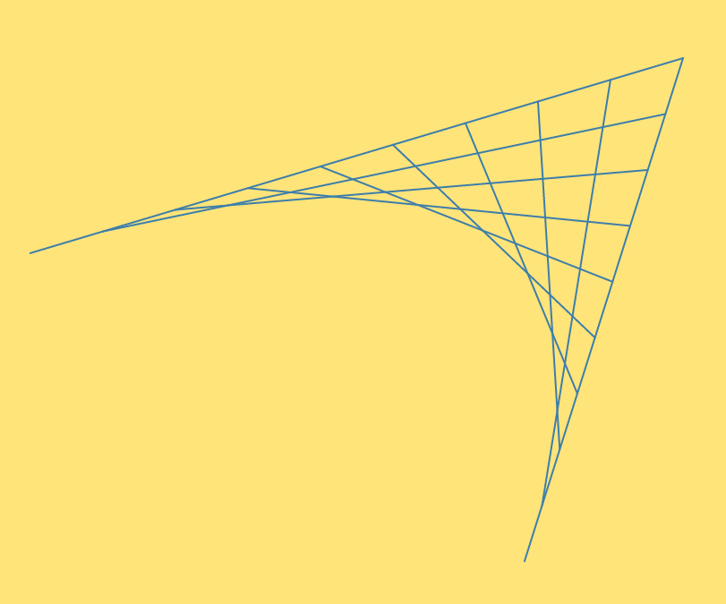

# Floater.js
by Alec Molloy.

Inspired by Dale Seymour's Book: "Introduction to Line Designs" Published by Dale Seymour Publications (1 Jun, 1990). ISBN: 0866515798

Floater.js is a JavaScript object that when instantiated, becomes a *Floater*. A Floater can have many *anchor points*. Anchor points can have *lines* drawn between them. A line can be *related* to other lines. These relationships mean that each line will have *connector lines* drawn between them. How many connector lines are drawn are dependent upon the *segments* property for each relationship.

## Example

In the above example, you can see a very simple floater with three anchor points. From those anchor points, the two first lines are drawn. (They happen to share an anchor point, and so the lines join each other.) These two lines are defined as being related, with 10 segments. You can count the 10 evenly-spaced points on each line that then are turned into anchor points for 10 lines that are drawn to the opposite point on the related line.

What's cool about Floaters? They are drawn with only straight lines, but the more segments drawn, the more it looks like a parabolic curve. Pretty cool, yeah?
